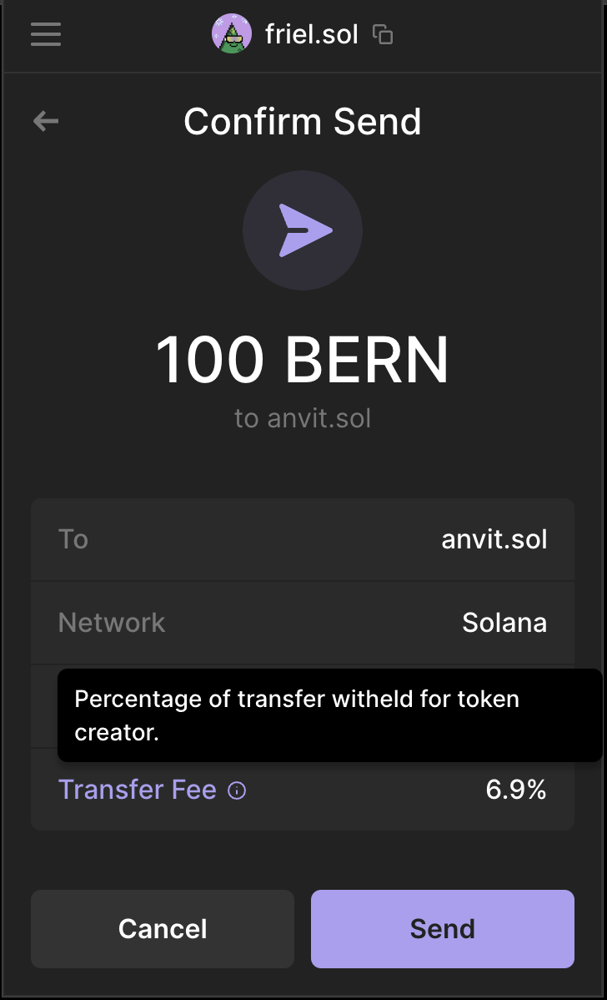

# Solana Token Extensions (Token22)

Phantom supports [fungible](../best-practices/tokens/home-tab-fungibles.md) and [non-fungible](../best-practices/tokens/collectibles-nfts-and-semi-fungibles.md) tokens created with the [Token-2022 Program](https://spl.solana.com/token-2022). At the time of this writing, Phantom supports the following Token Extensions:

## Group & Group Pointer

The [Group](https://spl.solana.com/token-2022/extensions#group) and [Group Pointer](https://spl.solana.com/token-2022/extensions#group-pointer) extensions allow token creators to create configurations for grouping tokens together. Phantom currently supports both extensions for non-fungible tokens in the Collectibles tab.

If a particular mint has a `memberAddress` listed under a `groupMemberPointer`, Phantom will look for the `mint` and `group` fields stored at this `memberAddress`. If the mint address matches the `mint` value, Phantom will use the `group` as the new group identifier.

Example: `8eDYWjDKmCR5B3UJm95gaG8zCdT5anWakTZG1PyWpBm9` ([Mainnet](https://solana.fm/address/8eDYWjDKmCR5B3UJm95gaG8zCdT5anWakTZG1PyWpBm9/extensions))

<figure><figcaption>
A collection configured by the Group &#x26; Group Pointer Extensions
</figcaption></figure> <figure><figcaption></figcaption></figure>

## Interest-Bearing Tokens

The [Interest-Bearing Tokens Extension](https://spl.solana.com/token-2022/extensions#interest-bearing-tokens) allows creators to set an interest rate on their tokens. This interest rate is for cosmetic purposes only, no new tokens are created as a result of the interest. If this extension is enabled, Phantom will display the current interest rate on the token's detail screen.

Example: `aNMXxywEHAH3VfWnaVwedLJWPT9NsxagsGTEQqS5WKK` ([Mainnet](https://solana.fm/address/aNMXxywEHAH3VfWnaVwedLJWPT9NsxagsGTEQqS5WKK?cluster=mainnet-alpha))

<figure><figcaption>
An Interest Rate displayed in Phantom
</figcaption></figure>

## Memo on Transfer

The [Memo on Transfer Extension](https://spl.solana.com/token-2022/extensions#required-memo-on-transfer) enforces that all incoming transfers must have an accompanying memo instruction right before the transfer instruction. If this extension is enabled, an account owner may choose to flip the required memo on or off. Phantom will allow a user to input a memo on transfers, even if it is optional.

Example: BonkEarn `CKfatsPMUf8SkiURsDXs7eK6GWb4Jsd6UDbs7twMCWxo` ([Mainnet](https://solana.fm/address/CKfatsPMUf8SkiURsDXs7eK6GWb4Jsd6UDbs7twMCWxo?cluster=mainnet-alpha))

<figure><figcaption>
A memo field in Phantom
</figcaption></figure> <figure><figcaption></figcaption></figure>

## Metadata Extension

The [Metadata Extension](https://spl.solana.com/token-2022/extensions#metadata) allows a token creator to include their metadata directly in the token's mint account. Phantom will display the `name` and `symbol` that is stored in the mint account, and look to the `uri` field for additional information such as the token's `image`.

Example: `EGKdqrXxFeTpRTskrH81xmefuTAU9MJGCDLoNss28a2` ([Devnet](https://solana.fm/address/EGKdqrXxFeTpRTskrH81xmefuTAU9MJGCDLoNss28a2?cluster=devnet-solana))

<figure><figcaption>
Metadata Extension Token Displayed in Phantom
</figcaption></figure>

## Metadata Pointer Extension

The [Metadata Pointer Extension](https://spl.solana.com/token-2022/extensions#metadata-pointer) allows a token creator to designate an address that describes the canonical metadata. Phantom supports the Metadata Pointer Extension. At the time of this writing, Phantom will assume all metadata schemas follow the [Metaplex Standard](https://docs.metaplex.com/programs/token-metadata/token-standard).

## Permanent Delegate

The [Permanent Delegate Extension](https://spl.solana.com/token-2022/extensions#permanent-delegate) allows token creators to grant unlimited delegation privileges over any account for that mint. If enabled, a delegate can can burn or transfer any amount of tokens. Phantom will display a warning for any token that has this extension enabled.

Example: `aNMXxywEHAH3VfWnaVwedLJWPT9NsxagsGTEQqS5WKK` ([Mainnet](https://solana.fm/address/aNMXxywEHAH3VfWnaVwedLJWPT9NsxagsGTEQqS5WKK?cluster=mainnet-alpha))

<figure><figcaption>
A Permanent Delegate warning displayed in Phantom
</figcaption></figure>

## Transfer Fees

The [Transfer Fees Extension](https://spl.solana.com/token-2022/extensions#transfer-fees) allows a token creator to assess fees on every token transfer. If this extension is enabled, Phantom will display the fee on the confirmation screen of every send.

Example: BonkEarn `CKfatsPMUf8SkiURsDXs7eK6GWb4Jsd6UDbs7twMCWxo` ([Mainnet](https://solana.fm/address/CKfatsPMUf8SkiURsDXs7eK6GWb4Jsd6UDbs7twMCWxo?cluster=mainnet-alpha))

<figure><figcaption>
A Transfer Fee displayed in Phantom
</figcaption></figure>

## Transfer Hooks

The [Transfer Hooks Extension](https://spl.solana.com/token-2022/extensions#transfer-hook) allows a token to invoke a custom program at the time of transfer. This program can be used to add custom logic on transfers, such as assessing royalties or determining if the transfer is allowed based on a range of on-chain data sources.

***

## Coming Soon

The following extensions are currently in development:

#### Confidential Transfers

#### Member & Member Pointer
