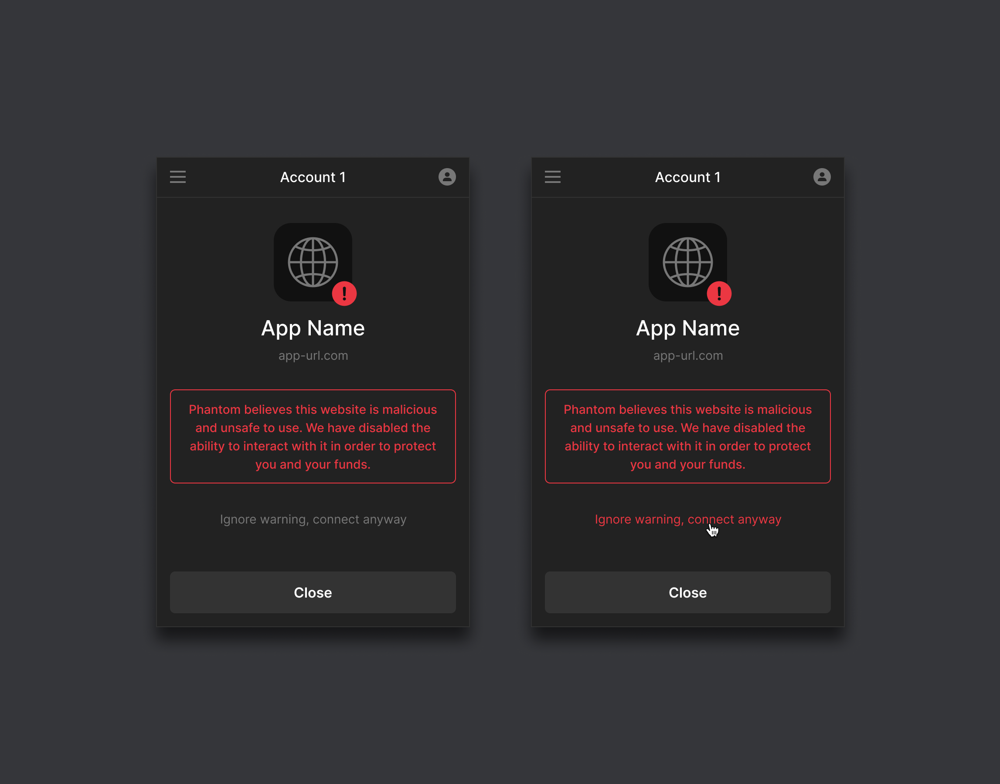

# Solana Wallet Standard

### Introduction

Wallet-Standard is a chain-agnostic set of interfaces and conventions that seeks to improve wallets' user and developer experience.

Let's understand the current state of wallets and the Solana wallet-adapter to understand the significance of Solana wallet standard.

### Wallet-Adapter

Today, most wallets on Solana are browser extensions. These extensions have extremely high privileges and talk to dApps by "injecting" code into every website the user visits.

There are several issues with the way injection works today:

* App devs need to plan what wallets they support, stick it in the dialog, and show buttons for each wallet
* Mobile browsers don’t have browser extensions (Workaround: Wallet Web Browsers: bad UX)
* Wallets attach to the window as global objects, and dapps need to be aware of where and how to find these objects
* All wallets can attach to `window.solana`, and nothing is stopping other wallets from pretending to be Phantom by setting `isPhantom=true`
* Wallets have different APIs: dapps need to know how to talk to specific wallets. These APIs can be divided into two behaviors:
  * Standard behavior: current functionalities
  * Custom behavior: possible, custom functionalities in the future\

### Wallet-Standard

What's the solution to the above?

Fix the detection of wallets on the window:

1. by standardizing the way wallets attach themselves to the window
2. by defining a set of standard APIs that dApps can rely on

Wallet Standard does exactly that! It:

* defines how the wallet attaches to the window in a simple standard way
* defines a part of the standard and custom behaviors (APIs)
* does not kill WA, but makes it more flexible: and ultimately loads significantly less code upfront

### Features of Wallet Standard

#### Avoids code bloating

If a dapp supports 20 wallets, it must load 5kb code per wallet (100k total). This bloating increases linearly as the number of wallets increase.

\~95% of this code will go unused, as the user will only use 1 or 0 wallets

<figure><figcaption></figcaption></figure>

Wallet standard turns this inside out: If dapps want to support 100 wallets: just install wallet-standard. Any wallet that supports the language of the standard is supported. Implementations are replaced with Interfaces!

<figure><figcaption></figcaption></figure>

#### Eliminates Attack Surfaces

Before wallet standard, every new wallet had to land a PR in the wallet-adapter.[@solana](https://twitter.com/solana)labs had to vet hundreds of PRs to ensure they weren't introducing malware into the adapter.

Eliminate the plugins -> eliminate attack surfaces!

<figure><figcaption></figcaption></figure>

#### Multi-Chain Standard

This is a Solana-first standard. But an active effort is being undertaken to fix these issues (which are very much present) on other chains like Sui Network and Ethereum.

#### No web3.js dependency

The interface in the standard will always input and output transactions, pubkeys, and signatures as raw bytes (`Uint8Array`). This is because some wallets do not use `web3.js` to minimize attack surface area.

#### Sidesteps Wallet Browsers

With Mobile Wallet Adapter already released on Android and soon to be released on IOS, it will soon be possible to surf dapps on native mobile browsers without breaking the flow to communicate with wallets.

###

### For Dapp developers

Wallet standard will cover support for:

1. signing one or more transactions
2. signing and sending one or more transactions
3. signing one or more "messages" (arbitrary byte arrays)
4. encryption and decryption

Try it in action here: [https://solana-labs.github.io/wallet-adapter/example/](https://solana-labs.github.io/wallet-adapter/example/)

Just update to the latest wallet-adapter release, and you're automatically wallet-standard compatible!

**IMPORTANT**: Make sure not to mutate transactions in place, or your dapp might break.



### Further Reading


