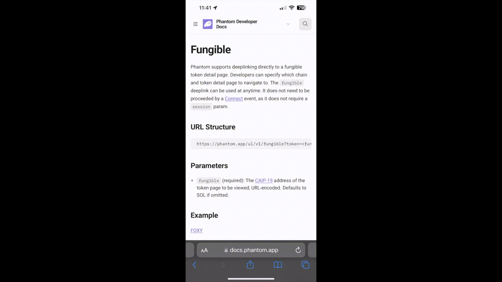

# Fungible

Phantom supports deeplinking directly to a fungible token detail page. Developers can specify which chain and token detail page to navigate to. The `fungible` deeplink can be used at anytime. It does not need to be proceeded by a [Connect](https://docs.phantom.app/phantom-deeplinks/provider-methods/connect) event, as it does not require a `session` param.

### URL Structure

```
https://phantom.app/ul/v1/fungible?token=<fungible>
```

### Parameters

* `fungible` (required): The [CAIP-19](https://github.com/ChainAgnostic/CAIPs/blob/main/CAIPs/caip-19.md) address of the token page to be viewed, URL-encoded. Defaults to SOL if omitted.

### Example

<figure><figcaption><p>Fungible Deeplink Example</p></figcaption></figure>

[FOXY](https://phantom.app/ul/v1/fungible?token=solana%3A101%2Faddress%3AFoXyMu5xwXre7zEoSvzViRk3nGawHUp9kUh97y2NDhcq)

```
https://phantom.app/ul/v1/fungible?token=solana%3A101%2Faddress%3AFoXyMu5xwXre7zEoSvzViRk3nGawHUp9kUh97y2NDhcq
```


