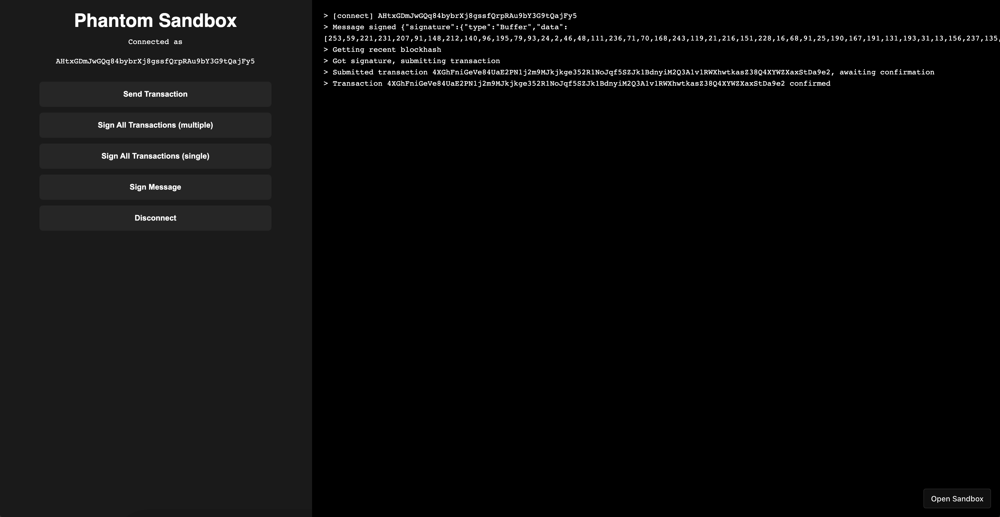

# Demo Applications

### Sandbox

For a live example of a simple integration with the Phantom [browser extension](../integrating/extension-and-mobile-browser/), check out our developer sandbox on [CodeSandbox](https://codesandbox.io/s/github/phantom-labs/sandbox?file=/src/App.tsx) and [GitHub](https://github.com/phantom-labs/sandbox).

### Deeplinking Demo App

For a live demonstration of Phantom's deeplinking API, please review our React Native demo app on [GitHub](https://github.com/phantom-labs/deep-link-demo-app). This application can be run locally and interacted with on iOS and Android devices via [Expo CLI](https://docs.expo.dev/workflow/expo-cli/).&#x20;

