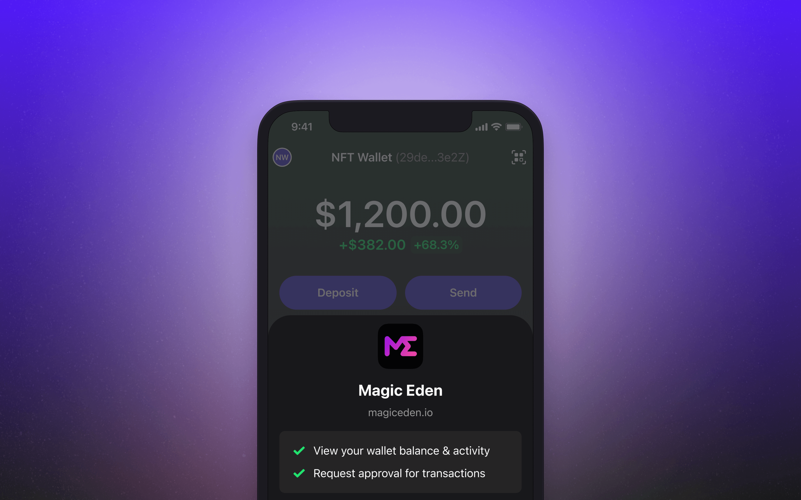

# Demo Applications

### Multichain Sandbox

For a live example of how a multichain dApp can integrate with Phantom, check out our Multichain Sandbox on [CodeSandbox](https://472igc.csb.app/) and [GitHub](https://github.com/phantom-labs/multi-chain-sandbox).

<figure><figcaption>
The Phantom Multichain Sandbox
</figcaption></figure>

### Solana-only Sandbox

For a live example of a Solana-only integration, check out our Solana Sandbox on [CodeSandbox](https://r3byv.csb.app/) and [GitHub](https://github.com/phantom-labs/sandbox).

### Deeplinking Demo App

For a live demonstration of Phantom's deeplinking API, please review our React Native demo app on [GitHub](https://github.com/phantom-labs/deep-link-demo-app). This application can be run locally and interacted with on iOS and Android devices via [Expo CLI](https://docs.expo.dev/workflow/expo-cli/).&#x20;

